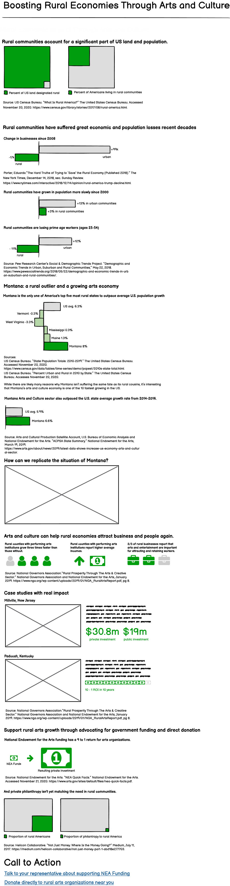
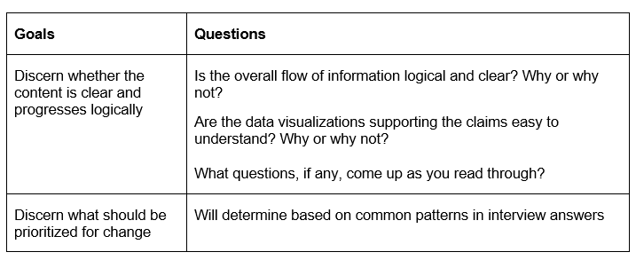

# Part II of Final Project by Morgan Kasprowicz
[click here to return to main page](/README.md).
## Wireframes and draft in Shorthand  
For my Part I, I inadvertently went a bit too far and drafted Wireframes for my project. I did, however, want to start building out in Shorthand so that I could figure out how the elements I'd imagined in Balsalmiq would transfer. I also wanted to spend some time drafting data visualizations to see what the best tools would be. 
### Balsalmiq Wireframes 
  
### [Link to Shorthand Version](https://preview.shorthand.com/ufDDnhlsmCCFqVvB)  
## User Research  
### Target Audience  
The target audience I hope to reach falls primarily into two groups: people who support the arts, but maybe don’t know the extent to which they can affect change in rural communities OR people who reside in rural communities and don’t know how the arts could support economic growth. The first group may include arts advocates or philanthropists. The second group doesn’t even need to know anything in particular about the arts – just be connected to rural communities.   
### Approach to choosing interviewees
Because my audience includes two separate groups of people, I wanted to make sure both groups were represented. For my arts advocate / philanthropist audience, I looked to two of my Masters of Arts Management colleagues. Because we regularly interact with and use similar data to what will be presented in my project, I trust these individuals to be able to pick out what is useful and compelling, what do they need to see more of, and what does not resonate. For my rural audience, I used two people from two different rural areas who care about economic development but aren’t themselves connected to the arts.  
### Goals and Questions
The following were my goals for my user research, as well as how the questions I created for my script connected to those goals:  
  
In addition to addressing what is "confusing," deciding what I prioritize for change will be determined by the aggregation of the feedback  
### Interview Script  
Hello and thank you for being willing to help me with user research for my Telling Stories with Data project. The purpose of my project is to demonstrate the promising potential for investments in arts and culture to help grow rural economies. I’m looking for feedback on what works, what is unclear, and what I should prioritize to change or add.  
Questions:  
•	Is the overall flow of information logical and clear? Why or why not?  
•	Are the data visualizations supporting the claims easy to understand? Why or why not?  
•	What questions, if any, come up as you read through?  
•	Were there any parts that were confusing?  
•	Did you feel compelled to take action at the end of the story?  
## Interview Findings  
   
## Planned Changes based on Feedback   
