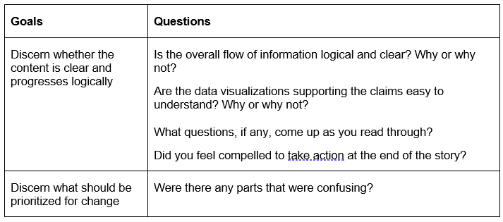

# Part II of Final Project by Morgan Kasprowicz
[click here to return to main page](/README.md).
## Wireframes and draft in Shorthand  
For my Part I, I inadvertently went a bit too far and drafted Wireframes for my project. I did, however, want to start building out in Shorthand so that I could figure out how the elements I'd imagined in Balsalmiq would transfer. I also wanted to spend some time drafting data visualizations to see what the best tools would be. 
### Balsalmiq Wireframes 
  
### [Link to Shorthand Version](https://preview.shorthand.com/ufDDnhlsmCCFqVvB)  
## User Research  
### Target Audience  
The target audience I hope to reach falls primarily into two groups: people who support the arts, but maybe don’t know the extent to which they can affect change in rural communities OR people who reside in rural communities and don’t know how the arts could support economic growth. The first group may include arts advocates or philanthropists. The second group doesn’t even need to know anything in particular about the arts – just be connected to rural communities.   
### Approach to choosing interviewees
Because my audience includes two separate groups of people, I wanted to make sure both groups were represented. I interviewed five people in total. For my arts advocate / philanthropist audience, I looked to two of my Masters of Arts Management colleagues. Because we regularly interact with and use similar data to what will be presented in my project, I trust these individuals to be able to pick out what is useful and compelling, what do they need to see more of, and what does not resonate. For my rural audience, I used two people from two different rural areas who care about economic development but aren’t themselves connected to the arts. I also picked one person who fell into both categories: an arts person who is from a rural setting. My interviewees also ranged in age from early 20s to mid 40s. 
### Goals and Questions
The following were my goals for my user research, as well as how the questions I created for my script connected to those goals:  
  
In addition to addressing what is "confusing," deciding what I prioritize for change will be determined by the aggregation of the feedback  
### Interview Script  
I asked the interviewees to look through both the wireframes and the Shorthand version. This is the script I used for the interviews:  

Hello and thank you for being willing to help me with user research for my Telling Stories with Data project. The purpose of my project is to demonstrate the promising potential for investments in arts and culture to help grow rural economies. I’m looking for feedback on what works, what is unclear, and what I should prioritize to change or add.  
Questions:  
•	Is the overall flow of information logical and clear? Why or why not?  
•	Are the data visualizations supporting the claims easy to understand? Why or why not?  
•	What questions, if any, come up as you read through?  
•	Were there any parts that were confusing?  
•	Did you feel compelled to take action at the end of the story?  
## Interview Findings  
   Most of the feedback was positive, in that most people thought the story flowed well, that the visualizations made sense, and that the call to action was appropriate. Here, however, is an aggregation of the more constructive feedback I recieved that will guide my changes this week:  
    
## Planned Changes based on Feedback   
As shared in the table above, I have two story priority changes and two priority data viz changes.   

For my story, I will first work on creating a stronger emotional connection for my reader. I'm going to look through articles about Montana's success in their arts economy and try to pull a direct quote that feels emotionally engaging. I may also do the same things for the case studies I used. Second, I'm going to try to use text better to connect the Montana to what comes before it and what comes after it. I think this can be simply some well-thought-out subtitles to new sections, but I might try some things and bring them back to the folks who gave me that feedback.   

For my visualizations, my biggest problem is getting them to render at an appropriate size in Shorthand. Someone mentioned that the slopes of my slope graphs don't appear to be changing because they're too wide. I have to figure out how to get them to a fixed size. I may need some help on that from others. I also got feedback that my charts that are side-by-side with text are too hard to read. I may have make those full-page media or figure out a way to adjust the size. I agree with all those comments and have been thinking about how to change them even before the feedback was given.  

Lastly, I have a few tweaks to make on my infogram graphics. I have to change the format of the one related to the Kentucky study (because feedback said it just didn't make sense) and experiment with how to make my use of color more consistent. I may flip the color order of a few pictorial line charts, per the feedback above. 

