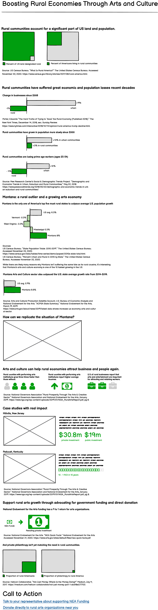

## Final Project Part I Assignment for Morgan Kasprowicz  
[link to main page](/README.md)  
# Outline
## Project Summary  
Arts and culture are a viable way to rebuild rural economies that have suffered lost of business and talent over the past few decades. Supporting government funding of the arts or donating to rural arts organizations directly is a tangible way that anyone can support this process. 
## Project Structure   
My hope is that the audience will first understand how big the proportion of rural land / rural people really are. Even I, a rural-raised person, had no idea that 97% of American land was rural; nor do I think I even knew that 20% of people are. That's a pretty large proportion. Showing these proportions in much nicer-looking tree maps (or actually I'm hoping unit charts) will help the audience root for our rural community "character."   
Next, it's time to quantify the problem. The audience will see the loss of business and prime-age workers in the past few decades. They'll also be able to see that rural populations are growing more slowly. There's more data that I can add to this section if these three visualizations don't have enough impact, as well, but I was trying to keep it simple and clear.  
The story pivots to the possible solution in discussion around Montana. Through the next three visualizations, the audience can see that Montana is growing faster in population that similar states and also has a faster growing arts economy. I do mention that this is, of course, correlary data, which is why I then pivot to talking about other examples of data supporting the claim that arts and culture can help grow rural economies.  
The final set of visualizations help the reader understand the tangible impact of arts and culture on rural economies through studies and case studies collected by the National Governors Association and the NEA. These will help the audience feel hopeful and more certain about how arts and culture impact rural communities. Hopefully they may also be curious to explore more about the projets featured in this section.  
Finally, the Call to Action provides two ways to act: support NEA funding (will link to Americans for the Arts advocacy pages because they do this work well) OR donate directly to rural arts organizations. I need to find a good link for this section (or provide a list of links). 
# Sketches
These are obviously all very rough and created with Balsamiq just to outline the story / visualizations. I'm hoping to turn some of these into more sophisticated charts or maybe change the chart type, be more sophisticated about the design, etc. Still, it's a fairly accurate outline of what I'm thinking.   
    
# The Data  
The use of all the data sets are detailed in the actual sketches above. In addition to the data sets below, I'm citing specific statistics from advocacy organizations or publications (as shared in the sketches), but here's a little more information and links to the larger data sets I'm using: 
### U.S. Census Data: ["Percent Rural and Urban in 2010 by State and County"](https://www2.census.gov/geo/docs/reference/ua/PctUrbanRural_County.xls)
This data helps me identify what states or areas are considered "rural," as well as helped me identify what the U.S. states were with the highest proportion of rural-dwelling residents. It also then becomes comparative data for population change and data on arts economies. It's also possible that I will use other data sets [from this page](https://www.census.gov/programs-surveys/geography/guidance/geo-areas/urban-rural/2010-urban-rural.html).
### U.S. Census Data:["State Population Totals: 2010-2019"](https://www.census.gov/data/tables/time-series/demo/popest/2010s-state-total.html)
This data set is going to be used to be cross-referenced with the one above to demonstrate shrinking more slowly growing rural populations.  
### [NASAA Creative Economy State Profiles](https://nasaa-arts.org/nasaa_research/creative-economy-state-profiles/)  
This data set speaks to the size and speed of growth for arts and culture economies across states and compares them to US. average data. This data set helps support the claim of Montana being an outlier in arts and culture economy growth. It also demonstrates that other rural states aren't growing their arts and culture economies as quickly at this time.   
### [Arts and Cultural Production Satellite Account from Bureau of Economic Analysis and National Endowment for the Arts](https://www.bea.gov/data/special-topics/arts-and-culture)  
I'll be using data from the tables and releases published by this account for both years 2016 and 2017 (the most recent available data). They don't publish whole data sets, but they have enough in their report summaries broken down by state for me to how arts and culture economies are growing / changing in different states and the U.S. as a whole. Again, this data establishes Montana as an outlier for a high percentage rural state with a thriving arts economy.   
### [National Governors Association report:"Rural Prosperity Through the Arts and Creative Sector" from January 2019](https://www.nga.org/wp-content/uploads/2019/01/NGA_RuralArtsReport.pdf)  
All my detailed visualizations about specific impacts on rural communities, as well as my case studies, come from here. This isn't a raw data set; rather, it's a long report from which I extracted data about specific studies used to formulate these policy action recommendations for rural communities. I may end up using more than what is shown in my sketches, but this is by far the most comprehensive source for proof points of arts and culture impact on rural economies.    
# Method and Medium  
My plan is to use Shorthand for my final project. I have liked what I've seen from examples in class of final projects created in Shorthand, and it seems like a tool that will work well for the outline I have sketched above. As an aside, the link to the story "template" in the assignment instructions was dead, so I may adjust the outline once I'm able to view that template.     

I plan to use Tableau for most of my visualizations, assuming the formatting capabilities will work for what I need to represent in some of my bar charts, for example. I do know I can make the unit charts I want to make using Tableau. For some of the more infographic-like representations in the latter sections of my project, I might need to use Infogram (which I've used before) or another tool that is more graphic design focused.    

My intention is to have the Shorthand visualization be appropriate for my final presentation. I do not anticipate using Powerpoint slides at any time. 
