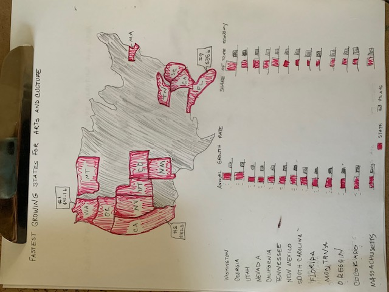

# Data Visualization Assignment 3 and 4 
[Return to main page](/README.md)
## Original Table: NEA's Fastest Growing States 
<blockquote class="imgur-embed-pub" lang="en" data-id="a/fYIKeWh" data-context="false" ></blockquote>  
Arts and Cultural Production Satellite Account, U.S. Bureau of Economic Analysis and National Endowment for the Arts. “ACPSA State Summary.” National Endowment for the Arts, March 19, 2019. https://www.arts.gov/sites/default/files/BEA_2019_State_Summary.pdf.  
    
 
### Why this table?
I chose this particular table because, as an arts management student and someone currently working in arts advocacy, data quantifying economic impact of the arts by location is crucial to both arts advovacy and market analysis for new organizations or programs. Unfortunately, while this data is both accurate and useful, the table format makes it difficult to digest quickly. Additionally, while quantifying the total value of the arts/culture industry is helpful (first column), when individual state values are compared to the whole, only California appears to make up a significant portion of the whole $804.2 billion national figure. As it stands, this column of data doesn't do much for the story of how quickly these states are growing in comparison to the two furthest right columns.  
## The Process
### Gleaning from Critique Process
The Critique process helped me identify what the strengths and limitations of the original table format, and thus helped me identify what I wanted to keep, scrap, and emphasize. The original table is complete, accurate, and tables are generally intuitive to read. I thus did not want to lose any of the strengths of how the data was originally visualized in the table. I did, however, want to make this data more aesthetically pleasing, engaging, and more quickly perceptable. In the original table, it's not easy to perceive how each states' data compares to the others, nor is it easy to perceive how the data in the fourth and fifth columns relates to the U.S. average. The data also isn't aesthetically pleasing or engaging, so I believed changing the chart type and color could improve that. Finally, arts managers might notice looking at this list that the fastest growing states aren't necessarily what we'd assume they might be. The states were also clustered in two major geographic areas, so I decided that it was important to the story to visualize where these states were on a map.  
### Wireframing and Responding to Feedback
  
This is the original wireframe that I created and shared with some of my arts management colleagues and my partner (who is not an arts manager) for feedback. I got very positive feedback about the use of the map. Folks were not clear on what the grey columns represented in the bar charts (I think my leged and the bottom was too small). They also asked me to add a more descriptive title to help the viewer know exactly what the data was telling them.    

Interestingly, once I started building out in Flourish, it became clear that a lot of my decisions about the bar graph portion were going to be made for me based on the limitations of Flourish. The grid shown in the wireframe was not going to be possible / reasonable. That ended up being fine, however, because the main issue of confusion, the grey bar, was much easier to label / clarify in the version I created. Also, as I was building, I realized it would have been redundant to represent the same U.S. average figure over and over again in 13 different charts. What you see below is the best solution I found based on the limitations of the tool. 

Although nobody provided any critical feedback on my map, I wanted to try to use color to show the rank of the top 13 states, so I added the gradient. Then, to make sure the data column about economic value add data was maintained, I added that column of data to the interactive pop-out labels. That way, as I discussed in my critique, I maintained the "completeness," but obscured the confusing piece in the table that led the viewer to compare even small state value add numbers (such as Montana's $1.5 billion) to a very large national number ($804.2 billion). 

## The Final Visualization(s)

  

  
